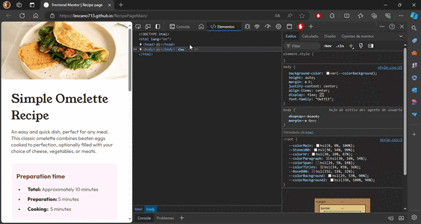

# Frontend Mentor - Recipe page solution

<div align="left">
  <a href="https://www.linkedin.com/in/danae-lescano-salvatierra" target="_blank">
    
  </a>
  <a href="https://lescano713.github.io/RecipePageMain/" target="_blank">
    
  </a>
  <a href="https://www.frontendmentor.io/profile/Lescano713" target="_blank">
    
  </a>
</div>


## Table of contents

- [Overview](#overview)
  - [The challenge](#the-challenge)
  - [Screenshot](#screenshot)
- [My process](#my-process)
  - [Built with](#built-with)
  - [What I learned](#what-i-learned)
  - [Continued development](#continued-development)


## Overview

### Screenshot




## My process

### Built with

- Semantic HTML5 markup
- CSS custom properties
- Flexbox
- CSS Grid
- mobile-first workflow


### What I learned

<p>Use of classes to separate the content and recycle them when it's necessary, making the structure cleaner and readeable.This approach not only improves code maintainability but also allows for easier updates and scalability.</p>

```html
<div class="recipe-preparation-time">
  <h3>Preparation time</h3>
  <ul class="preparation-time-list">
    <li><span class="span-bold">Total:</span> Approximately 10 minutes</li>
    <li><span class="span-bold">Preparation:</span> 5 minutes</li>
    <li><span class="span-bold">Cooking:</span>: 5 minutes</li>
  </ul>
</div>
<div class="nutrition-table">
  <p>Carbs</p>
  <span class="grams-table">0g</span>
</div>
<div class="nutrition-table">
  <p>Protein</p>
  <span class="grams-table">20g</span>
</div>
```

<p>Using media queries to fit the content depending on the user's device ensures that the layout is responsive and looks good on all screen sizes. This is crucial for improving user experience on different devices.</p>

```css
@media (min-width: 500px) {
    section{
        margin: 8px 30px 8px 30px;
        
    }
    body{
        padding: 50px;
    }
}
```


### Continued development

<p>For future development, I plan to focus on enhancing my skills in CSS animations to create more interactive and engaging user interfaces. Additionally, I want to delve deeper into JavaScript to add more dynamic functionalities to my web projects.</p>

<p>Another area for improvement is optimizing the website for better performance by minimizing CSS and JavaScript files, and ensuring images are properly compressed without losing quality.</p>

